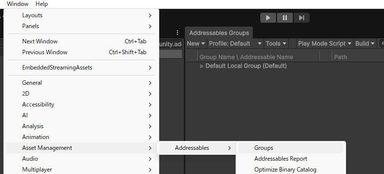
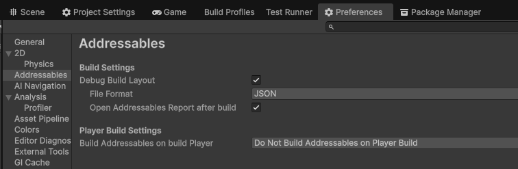
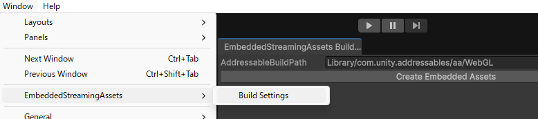


# EmbeddedStreamingAssets

[](LICENSE)

unityroomなどWeb(GL) ビルドで StreamingAssets フォルダをアップロードできない環境のために、StreamingAssets フォルダの内容をProject内に保存し実行時にメモリ上に展開する Unity パッケージです。

インスパイア元は[StreamingAssetsInjector](https://github.com/KurisuJuha/StreamingAssetsInjector)です。

## Requirements
Unity 2022.3 or later

## Installation

PackageManger の Add package from git URL に以下を入力

```
https://github.com/Akeit0/EmbeddedStreamingAssets.git?path=Packages/EmbeddedStreamingAssets
```

または manifest.json の dependencies ブロックに以下を追加

```
"com.akeit0.embedded-streaming-assets": "https://github.com/Akeit0/EmbeddedStreamingAssets.git?path=Packages/EmbeddedStreamingAssets"
```
## Usage
> [!WARNING]
> インストールするだけだとだと動きません

### Addressables


> [!IMPORTANT]
> 手動ビルド忘れやすい！Addressableの変更後のビルド前に必ず行うこと！！

Window/Asset Management/Addressables/GroupsからAddressables Groupsを開きます。
Build/New Buildから手動でビルドします。




手動でビルドするので、Preferencesから`Do Not Build Addressables on Player Build`推奨

### Save


Window/EmbeddedStreamingAssets/BuildSettingsからWindowを開き、
Embed Assetsを押すとStreamingAssetsのデータが保存されます。(`Skip Auto Embedding On Build`を有効にしなければ自動実行されます。)

以上の手順で
```csharp
UnityWebRequest.Get("StreamingAssets/sample.txt");
```

やAddressables, Localizationが使えるようになります。
## License

[LICENSE](https://github.com/Akeit0/EmbeddedStreamingAssets/blob/main/LICENSE)
